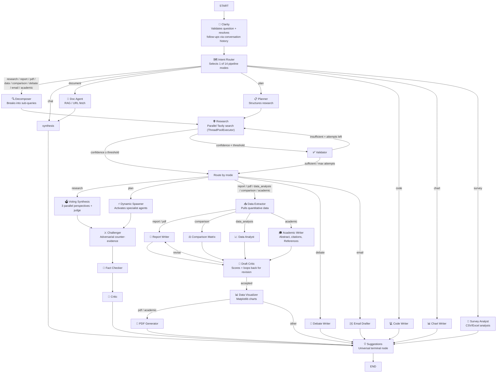

# Ares — Autonomous Research & Evidence System

A production-grade **multi-agent research assistant** built with **LangGraph**, **FastAPI**, **ChromaDB RAG**, and **SSE streaming**. Ask a single question — Ares orchestrates 26 specialized agents across 14 pipeline modes, runs parallel web searches, fact-checks and critiques its own drafts, generates charts and PDFs, and streams the answer in real time.

---

## Architecture



*Simplified for readability — self-correction loops (draft revision, research retry) and exact edge conditions live in `app/graph.py`.*

---

## Features

| Category | What's included |
|---|---|
| **14 pipeline modes** | Research, Report, PDF, Academic Paper, Data Analysis, Comparison, Debate, Email, Plan, Chat, Document, Code, Chart, Survey |
| **26 LangGraph agents** | Each a typed node with structured output and confidence scoring |
| **Self-correction** | Fact-checker verifies claims, critic scores drafts, draft-critic loop revises weak writing, challenger hunts adversarial counter-evidence |
| **Voting synthesis** | Research answers: 3 independent LLM perspectives + a 4th judge that picks the strongest and explains why |
| **Multi-provider LLM** | Groq → Cerebras → Gemini → OpenRouter fallback chain, auto-advances on rate limits, live "switching provider" status shown mid-request |
| **RAG + reranking** | ChromaDB vector store + FlashRank cross-encoder; multi-file support |
| **Image analysis** | Upload PNG/JPG → Gemini Vision describes it → stored as searchable RAG chunks |
| **Streaming SSE** | Typed events: `node_start`, `token`, `mode`, `confidence`, `chart`, `pdf_ready`, `sources`, `provider_switch`, `complete`, … |
| **Persistent memory** | SQLite checkpointer (LangGraph) with proper multi-turn message accumulation + rolling conversation summary + cross-session entity memory |
| **Exports** | PDF (ReportLab), PPTX (python-pptx), shareable public links |
| **Voice input** | Web Speech API mic button in the UI |
| **Analytics** | `/dashboard` with Chart.js — daily volume, mode distribution, provider split, avg latency |
| **Observability** | LangSmith tracing (set `LANGSMITH_API_KEY`) |
| **Integrations** | Slack webhook, SMTP email, scheduled research tasks |
| **Auth** | Cookie-based password gate (`APP_PASSWORD` env var) |
| **Rate limiting** | SlowAPI per-route limits |

---

## Quick Start

```bash
git clone https://github.com/YOUR_USERNAME/ares-research-assistant
cd ares-research-assistant

python -m venv .venv
.venv/Scripts/activate          # Windows
# source .venv/bin/activate     # Mac/Linux

pip install -r requirements.txt

cp .env.example .env
# Edit .env — fill in at least GROQ_API_KEY + TAVILY_API_KEY
```

Start the server:

```bash
uvicorn app.main:app --host 0.0.0.0 --port 8000 --workers 1
```

Open http://localhost:8000.

---

## Docker (one command)

```bash
cp .env.example .env   # fill in your keys
docker compose up --build
```

Access at http://localhost:8000. All SQLite databases and generated files are mounted as volumes so they persist across restarts.

---

## Environment Variables

| Variable | Required | Description |
|---|---|---|
| `GROQ_API_KEY` | one of these | Groq LLM (primary, fastest) |
| `CEREBRAS_API_KEY` | one of these | Cerebras LLM (fast fallback) |
| `GEMINI_API_KEY` | one of these | Gemini 2.0 Flash (vision + fallback) |
| `OPENROUTER_API_KEY` | one of these | OpenRouter (final fallback) |
| `TAVILY_API_KEY` | **required** | Web search |
| `APP_PASSWORD` | optional | Enable password gate |
| `LANGSMITH_API_KEY` | optional | Enable LangSmith tracing |
| `LANGSMITH_PROJECT` | optional | LangSmith project name (default: `ares-research`) |
| `SLACK_WEBHOOK_URL` | optional | Post completed research to Slack |
| `SMTP_HOST` | optional | SMTP for scheduled email delivery |
| `SMTP_USER` / `SMTP_PASSWORD` | optional | SMTP credentials |

---

## Project Layout

```
app/
  main.py              FastAPI app — all routes, SSE, auth, analytics
  graph.py             LangGraph 26-node state machine
  state.py             AgentState TypedDict
  config.py            Pydantic settings (all env vars)
  llm.py               Multi-provider fallback LLM factory
  agents/
    clarity.py           Question validation + history-aware follow-up resolution
    intent_router.py     Pipeline mode selection (14 modes)
    decomposer.py        Sub-query generation
    research.py          Parallel Tavily search (ThreadPoolExecutor)
    validator.py         Research quality gate
    synthesis.py         Streaming answer + entity memory
    voting_synthesis.py  3-perspective parallel synthesis + judge (research mode)
    challenger.py        Adversarial counter-evidence search + reconciliation
    fact_checker.py      Claim verification
    critic.py            Research quality scoring
    draft_critic.py      Writing quality scoring + revision loop
    planner.py           Multi-step research plan (plan mode)
    dynamic_spawner.py   Activates specialist agents (plan mode)
    comparison_matrix.py Side-by-side entity comparison
    data_analyst.py       Numeric/statistical breakdown
    data_extractor.py    Pulls quantitative data before visual/writer nodes
    data_visualizer.py   Matplotlib chart generation
    survey_analyst.py    CSV/Excel survey analysis
    academic_writer.py   Academic paper — Abstract, citations, References
    report_writer.py
    pdf_generator.py     ReportLab PDF
    pptx_generator.py    python-pptx PowerPoint
    chart_writer.py      Matplotlib charts (chart mode)
    doc_agent.py         RAG / URL fetch (multi-file)
    code_writer.py
    debate_writer.py
    email_drafter.py
    suggestions.py       Universal terminal node — proposes follow-ups
  rag/
    loader.py          PDF/DOCX/TXT chunker
    store.py           ChromaDB store + search_multi
    reranker.py        FlashRank cross-encoder
  memory/
    entity_store.py    Cross-session entity fact memory
  tools/
    search.py          Tavily wrapper
static/
  index.html           Full-featured chat UI
  dashboard.html       Analytics dashboard
eval.py                RAG evaluation script (faithfulness + relevance scoring)
Dockerfile
docker-compose.yml
```

---

## API Endpoints

| Method | Path | Description |
|---|---|---|
| `GET` | `/` | Chat UI |
| `GET` | `/chat/stream` | SSE streaming chat |
| `POST` | `/chat` | Non-streaming chat |
| `POST` | `/resume` | Answer clarification |
| `POST` | `/upload` | Upload document (PDF, DOCX, TXT, MD) |
| `POST` | `/upload/image` | Upload image for vision analysis |
| `GET` | `/history` | Session history |
| `GET` | `/analytics` | Usage analytics JSON |
| `GET` | `/dashboard` | Analytics dashboard UI |
| `GET` | `/calibration` | Confidence-threshold calibration report |
| `GET` | `/prompt-health` | Per-node quality metrics (draft scores, fact-check pass rate) |
| `GET` | `/cost/{thread_id}` | Token/cost tracking for one thread |
| `GET` | `/cost` | Global token/cost tracking |
| `GET` | `/cache/stats` | Search-result cache stats |
| `POST` | `/export/pptx` | Export report as PPTX |
| `POST` | `/share` | Create shareable public link |
| `GET` | `/r/{share_id}` | Access shared report (no auth) |
| `POST` | `/schedule` | Schedule a research task |
| `GET` | `/schedule` | List scheduled tasks |
| `POST` | `/auth/login` | Login |
| `POST` | `/auth/logout` | Logout |
| `GET` | `/auth/status` | Auth status |
| `GET` | `/health` | Health check |
| `GET` | `/diagnostics` | Ops/debugging: node-level checkpoint stats |
| `GET` | `/errors` | Recent failed-node error log |

---

## Evaluation

```bash
python eval.py                         # run default 5-query suite
python eval.py --query "custom query"  # test a single query
```

Scores each response on faithfulness (0-10), answer relevance (0-10), and retrieval quality, then saves `eval_results.json`.

---

## Deploy to Railway

[](https://railway.app)

1. Push this repo to GitHub
2. Create a new Railway project → **Deploy from GitHub repo**
3. Add environment variables (at minimum `GROQ_API_KEY` + `TAVILY_API_KEY`)
4. Railway auto-detects the `Dockerfile` — done

---

## Tech Stack

- **LangGraph** 0.2+ — stateful multi-agent graph
- **LangChain** — LLM abstraction, structured output
- **FastAPI** + **uvicorn** — async HTTP + SSE
- **ChromaDB** — local vector store
- **FlashRank** — cross-encoder reranking
- **ReportLab** — PDF generation
- **python-pptx** — PowerPoint export
- **Matplotlib** — chart rendering
- **aiosqlite** — async SQLite (history + checkpoints + analytics)
- **Groq / Cerebras / Gemini / OpenRouter** — LLM providers
- **Tavily** — web search API
